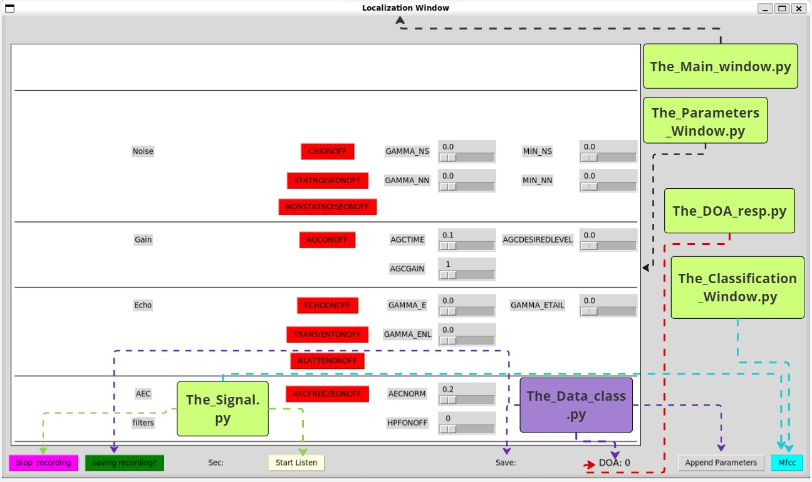
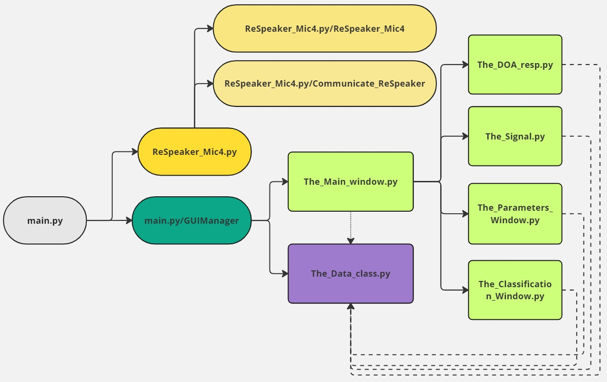
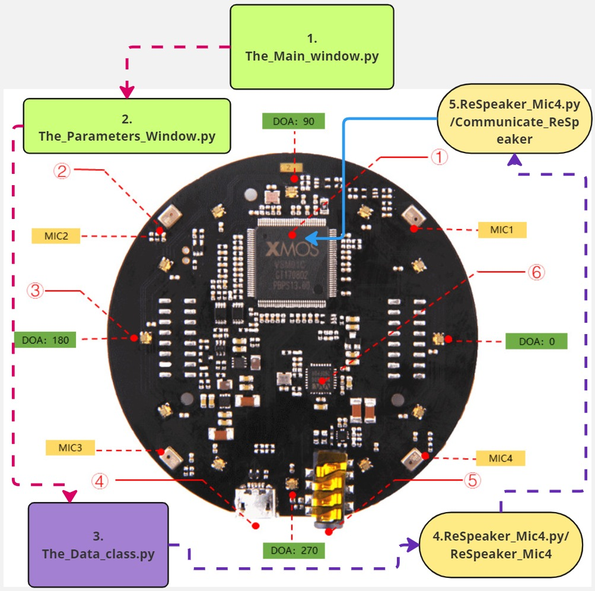

# ReSpeaker Mic Array v2.0 on RaspberryPi 4 model B 64bit for drone tracking   
## Description
Ability to adjust the parameters of the ReSpeaker to locate a drone further away than the ReSpeaker can.
Implemented:
- ReSpeaker parameter adjustment
- Recording 
- Mfcc and pre-processing of data that can be used to identify drones 
## Installation
1.  sudo apts
```bash
sudo apt update
sudo apt install -y build-essential libreadline-dev libncurses-dev libssl-dev libsqlite3-dev tk-dev libgdbm-dev libc6-dev libbz2-dev zlib1g-dev openssl libffi-dev
sudo apt-get install -y libportaudio2 llvm libfreetype6-dev
sudo apt-get install -y gcc libsndfile1 portaudio19-dev ffmpeg tk alsa-utils usbutils x11-apps
sudo apt-get install -y cmake libjpeg-dev
sudo apt-get install -y python3-scipy python3-pip
sudo apt-get install -y libopenblas-dev liblapack-dev gfortran
sudo apt-get install -y lsb-release wget software-properties-common gnupg
sudo apt-get install libatlas-base-dev  libopenjp2-7
sudo apt-get install -y jackd2
sudo apt-get install python3-dev
sudo apt-get install -y python3-tk
sudo apt update
sudo apt install pulseaudio


```
2. Set Up Python Virtual Environment
```bash
sudo apt install python3-venv
python3 -m venv doa_env
source  /home/<user>/doa_env/bin/activate
(doa_env) pi@raspberrypi:~ $ python --version
>>Python 3.11.2

```
3. Install Python Packages
```bash
** if you are in windows, prefer to use conda based on compatibilities issues 
pip install pyusb keyboard sounddevice PyAudio click
pip install audioread==2.1.9 joblib==1.2.0
pip install llvmlite==0.43.0 numba==0.60.0 decorator==5.1.1 soundfile==0.12.1 resampy==0.3.1
pip install --verbose wheel== 0.43.0
pip install --verbose meson==1.4.1
pip install --verbose meson-python==0.16.0
pip install --verbose Cython==3.0.10
pip install --verbose pybind11==2.13.0
pip install --verbose pythran==0.16.1
pip install --verbose numpy==1.26.4
pip install --verbose scipy==1.13.1
pip install --verbose scikit-learn==1.4.0
pip install --verbose matplotlib==3.8.2
pip install --verbose librosa==0.10.1
pip install --verbose tflite-runtime==2.14.0

```
problem with pyaudio -> sudo apt install python3-pyaudio 
					 ->  sudo apt-get install portaudio19-dev

3. Anaconda
If you want to run them with anaconda then :   
```bash 
conda env create -f doa.yaml
conda activate doa
```
4. For the first time
```bash
git clone https://github.com/kos00pas/doa_raspb.git
cd doa_raspb
```

5. For the first time 
```bash
sudo apt-get update
sudo pip install pyusb click
#or
sudo apt install python3-usb python3-click

git clone https://github.com/respeaker/usb_4_mic_array.git
cd usb_4_mic_array


```


6. For every time 
```bash
source /home/<user>/doa_env/bin/activate
cd <path_to>/doa_raspb/code_3
python main.py
```
7. if find this error:
```bash
Traceback (most recent call last):
  File "/home/pi/Desktop/doa_raspb/code_3/main.py", line 20, in <module>
    resp4=resp.ReSpeaker_Mic4( ) #1
          ^^^^^^^^^^^^^^^^^^^^^^
  File "/home/pi/Desktop/doa_raspb/code_3/ReSpeaker_Mic4.py", line 232, in __init__
    self.Write_initial_Parameters()
  File "/home/pi/Desktop/doa_raspb/code_3/ReSpeaker_Mic4.py", line 449, in Write_initial_Parameters
    self.write_param('AGCTIME',
  File "/home/pi/Desktop/doa_raspb/code_3/ReSpeaker_Mic4.py", line 535, in write_param
    Mic_tuning.write(param, argums)
  File "/home/pi/Desktop/doa_raspb/code_3/ReSpeaker_Mic4.py", line 165, in write
    self.dev.ctrl_transfer(
  File "/home/pi/doa_env/lib/python3.11/site-packages/usb/core.py", line 1071, in ctrl_transfer
    self._ctx.managed_open()
  File "/home/pi/doa_env/lib/python3.11/site-packages/usb/core.py", line 113, in wrapper
    return f(self, *args, **kwargs)
           ^^^^^^^^^^^^^^^^^^^^^^^^
  File "/home/pi/doa_env/lib/python3.11/site-packages/usb/core.py", line 131, in managed_open
    self.handle = self.backend.open_device(self.dev)
                  ^^^^^^^^^^^^^^^^^^^^^^^^^^^^^^^^^^
  File "/home/pi/doa_env/lib/python3.11/site-packages/usb/backend/libusb1.py", line 804, in open_device
    return _DeviceHandle(dev)
           ^^^^^^^^^^^^^^^^^^
  File "/home/pi/doa_env/lib/python3.11/site-packages/usb/backend/libusb1.py", line 652, in __init__
    _check(_lib.libusb_open(self.devid, byref(self.handle)))
  File "/home/pi/doa_env/lib/python3.11/site-packages/usb/backend/libusb1.py", line 604, in _check
    raise USBError(_strerror(ret), ret, _libusb_errno[ret])
usb.core.USBError: [Errno 13] Access denied (insufficient permissions)
```

## Functionality 
When you run the code then you can:
- Adjust the parameters of ReSpeaker Mic Array v2.0 to adjust the way that device 'listen'
- Enable the saving of recording
- Record the audio in a single channel that is affected based  on the parameters and enable listening 
    -     save at : folder Saved_Recording
- When recording is running then you can create a mfcc when the data is enough to produce (after approximate 5 seconds after recording started), alongside with the signal that mfcc was created 
    -     save at: folder MFCC_SIGNAL_saves, files:
                                      1. mfcc.csv
                                      2. signal.csv


- Append the parameters and DOA in a csv 
  -         save at : folder Saved_DOA_n_Params, files:
                                        1. DOA_timestamp.csv 
                                        2. Parameters_timestamp.csv 


Here you can see which class is called when you press a function



## The Structure of Code 
### File/class and owning 
Here you can see which class own other class
- main.py
  - ReSpeaker_Mic4.py
	  - ReSpeaker_Mic4.py/ReSpeaker_Mic4
        - ReSpeaker_Mic4.py/Communicate_ReSpeaker
  - main.py/GUIManager
	  - The_Data_Class.py
	  - The_Main_Window.py
        - The_DOA_resp.py
        - The_Signal.py
        - The_Parameters_Window.py
        - The_Classification_Window.py
        



### ReSpeaker Communication
- This is the procedure when you want to interact with the ReSpeaker Mic Array v2.0.
  - Lets see two examples of parameters (1. DOA,2. high-pass )
  #### Get DOA(Direction of Arrival)
     - The [1.The_Main_window.py] initiates the doa class:
    ```bash 
          self.doa_plot = The_DOA_resp.The_DOA_resp(self.DATA, self)
    ```
    - The [The_DOA_resp.doa_resp] communicates with ReSpeaker every [The_DOA_resp.DATA.doa_refresh] second to get the DOA: 
    ```bash 
     doa_azimuth_degrees = self.DATA.resp4.doa_from_respeaker 
   ```
    - Then print the now doa to the GUI:
    ```bash 
      self.main_window.doaa_label.config(font="bold",text=f'DOA: {doa_azimuth_degrees}')
    ```
  #### Changing the high pass filter 
    - The [1.The_Main_window.py] give space to [2.The_Parameters_Window] through self(1).control_frame
    - In the [2.The_Parameters_Window.__init__] we specify the row of filters categories, and we create the fader like this: 
            ```bash
                self.HPFONOFF = tk.DoubleVar()
                self.create_scale(space, 0, 3, 1, self.HPFONOFF, roww, 2, 'HPFONOFF', textt="HPFONOFF")
             ```
    - When the user moves the fader, self.create_scale will call the following to write the new value into the specific parameter 
            ```bash
            self.DATA.resp4.write_param(param, value)
            ```
    which:
      - 1. DATA represents:  [3.the The_Data_Class.py]  and 
      - 2. resp4 represents:  [4.the ReSpeaker_Mic4.py/ReSpeaker_Mic4]
      - 3. write_param represent: [5. ReSpeaker_Mic4.py/Communicate_ReSpeaker] 
    
    **The initial photo is from :https://wiki.seeedstudio.com/ReSpeaker_Mic_Array_v2.0/
