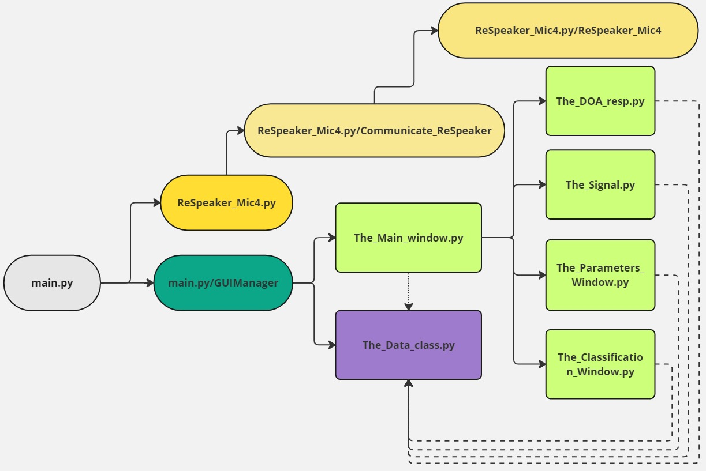
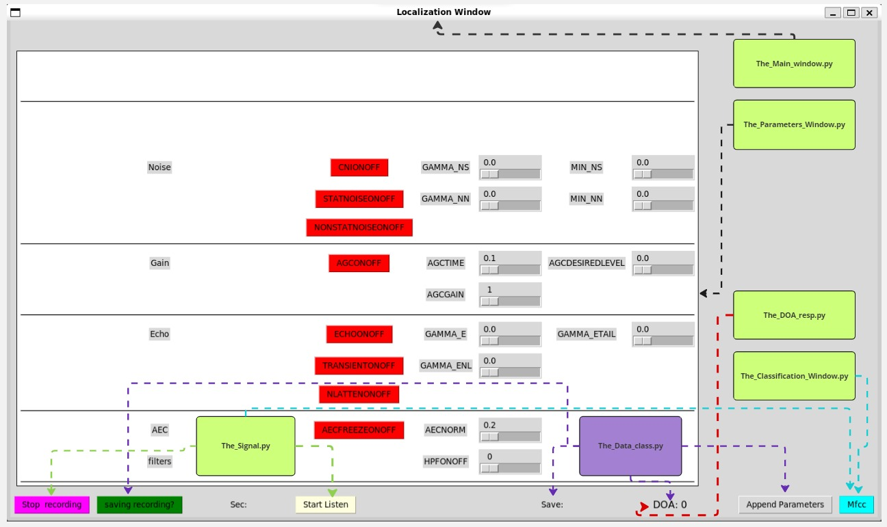

# ReSpeaker  Mic4 Array v2 at RaspberryPi 4 model B 64bit for Direction of Drone   

## Description
Ability to adjust the parameters of ReSpeaker in order to localize a Drone in the further distance that the ReSpeaker can.
Implemented:
- Parameter adjusment of ReSpeaker
- Recording 
- Mfcc and pre-process of data that can use to identify drone 

## Installation
1.  sudo apts
```bash
sudo apt update
sudo apt install -y build-essential libreadline-dev libncurses-dev libssl-dev libsqlite3-dev tk-dev libgdbm-dev libc6-dev libbz2-dev zlib1g-dev openssl libffi-dev
sudo apt-get install -y libportaudio2 llvm libfreetype6-dev
sudo apt-get install -y gcc libsndfile1 portaudio19-dev ffmpeg tk alsa-utils usbutils x11-apps
sudo apt-get install -y cmake libjpeg-dev
sudo apt-get install -y python3-scipy python3-pip
sudo apt-get install -y libopenblas-dev liblapack-dev gfortran
sudo apt-get install -y lsb-release wget software-properties-common gnupg
sudo apt-get install libatlas-base-dev  libopenjp2-7
sudo apt-get install -y jackd2
sudo apt-get install python3-dev
sudo apt-get install -y python3-tk
sudo apt update
sudo apt install pulseaudio


```
2. Set Up Python Virtual Environment
```bash
sudo apt install python3-venv
python3 -m venv doa_env
source  /home/<user>/doa_env/bin/activate
```
3. Install Python Packages
```bash
pip install pyusb keyboard sounddevice PyAudio click
pip install audioread==2.1.9 joblib==1.2.0
pip install llvmlite==0.43.0 numba==0.60.0 decorator==5.1.1 soundfile==0.12.1 resampy==0.3.1
pip install --verbose wheel== 0.43.0
pip install --verbose meson==1.4.1
pip install --verbose meson-python==0.16.0
pip install --verbose Cython==3.0.10
pip install --verbose pybind11==2.13.0
pip install --verbose pythran==0.16.1
pip install --verbose numpy==1.26.4
pip install --verbose scipy==1.13.1
pip install --verbose scikit-learn==1.4.0
pip install --verbose matplotlib==3.8.2
pip install --verbose librosa==0.10.1
```
problem with pyaudio -> sudo apt install python3-pyaudio 
					 ->  sudo apt-get install portaudio19-dev


3. For the first time 
```bash
sudo apt-get update
git clone https://github.com/kos00pas/doa_raspb.git
cd doa_raspb/usb_4_mic_array
source /home/<user>/doa_env/bin/activate
python dfu.py --download 6_channels_firmware.bin  # The 6 channels version 
```


4. For every time 
```bash
source /home/<user>/doa_env/bin/activate
cd <path_to>/doa_raspb/code
python main.py
```

## Structure of Code 
### File/class and owning 

- main.py
  - ReSpeaker_Mic4.py
	  - ReSpeaker_Mic4.py/ReSpeaker_Mic4
	  - ReSpeaker_Mic4.py/Communicate_ReSpeaker
  - main.py/GUIManager
	  - The_Data_Class.py
	  - The_Main_Window.py
        - The_DOA_resp.py
        - The_Signal.py
        - The_Parameters_Window.py
        - The_Classification_Window.py


### Gui button per class 


1. 